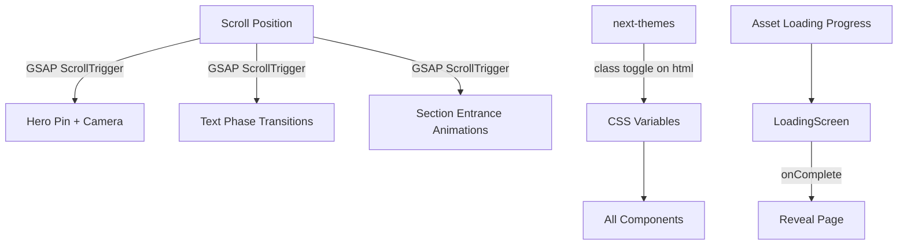

# Design Document: Dilitech Premium Website

## Overview

This design delivers a premium, immersive single-page website for Dilitech — a computer retail company in Mali. The site combines a 3D product hero (React Three Fiber), scroll-driven storytelling (GSAP ScrollTrigger), glassmorphism UI, and dark/light theming into a cohesive Apple-inspired experience. All user-facing text is in French.

The architecture follows a client-heavy, single-page pattern built on Next.js 16 App Router. The page is a single route (`/`) composed of vertically stacked section components. A global scroll controller orchestrates GSAP-based entrance animations and the pinned hero storytelling sequence. The 3D viewer is dynamically imported to keep the initial bundle lean, with a static fallback for devices without WebGL support.

Key technical decisions:
- React Three Fiber + Drei for 3D rendering, loaded via `next/dynamic` with `ssr: false`
- GSAP 3.15 with ScrollTrigger plugin for all scroll-based animations (pinning, scrubbing, entrance effects)
- `next-themes` for dark/light mode with `localStorage` persistence and system preference detection
- Component-level lazy loading and Next.js `<Image>` for performance
- Tailwind CSS v4 with CSS custom properties for theming
- Inter font (already configured) as the sole typeface

## Architecture

### High-Level Component Tree

```
RootLayout (app/layout.tsx)
└── ThemeProvider (next-themes)
    └── HomePage (app/page.tsx) — client component
        ├── LoadingScreen
        ├── Navbar
        ├── HeroSection
        │   ├── Three_D_Viewer (dynamic import, no SSR)
        │   │   ├── Canvas (R3F)
        │   │   │   ├── ComputerModel (useGLTF → animation.glb)
        │   │   │   ├── CameraController (scroll-driven)
        │   │   │   └── Lighting (environment + directional)
        │   │   └── WebGLFallback (static image)
        │   └── ScrollStoryOverlay (text phases)
        ├── ProductGrid
        ├── ConversionSection
        ├── ServicesSection
        ├── TestimonialsSection
        ├── AboutSection
        └── Footer
```

### Data Flow



### File Organization

```
app/
  layout.tsx          — RootLayout + ThemeProvider wrapper
  page.tsx            — HomePage orchestrator (client component)
  globals.css         — Tailwind v4 + CSS variables + theme tokens

components/
  loading-screen.tsx  — Premium loading experience
  navbar.tsx          — Glassmorphism sticky nav + mobile menu
  hero-section.tsx    — Hero container + scroll story overlay
  three-d-viewer.tsx  — R3F Canvas + model + camera (dynamic import wrapper)
  computer-model.tsx  — useGLTF model loader + idle rotation
  camera-controller.tsx — Scroll-driven camera orbit
  product-grid.tsx    — Brand cards grid
  conversion-section.tsx — Guided selling + WhatsApp CTA
  services-section.tsx   — Service cards
  testimonials-section.tsx — Circular testimonials
  about-section.tsx   — Company presentation
  footer.tsx          — Map + contact + socials
  theme-toggle.tsx    — Dark/light mode switch
  ui/
    button.tsx        — shadcn button (existing)

lib/
  utils.ts            — cn() utility (existing)
  animations.ts       — GSAP ScrollTrigger registration + shared animation configs
  constants.ts        — Product data, testimonials data, services data, nav links

hooks/
  use-loading-progress.ts — Asset loading state tracker
  use-scroll-animations.ts — GSAP ScrollTrigger setup hook
  use-media-query.ts      — Responsive breakpoint detection
  use-reduced-motion.ts   — prefers-reduced-motion detection
```

## Components and Interfaces

### LoadingScreen

```typescript
interface LoadingScreenProps {
  onLoadingComplete: () => void;
}
```

- Displays Dilitech logo with fade-in animation
- Shows animated progress bar reflecting actual asset loading (fonts, images, 3D model)
- Minimum display time: 1500ms (even on fast connections)
- Fade-out transition: 800ms (within 600–1000ms range)
- Uses `use-loading-progress` hook to track readiness

### Navbar

```typescript
interface NavLink {
  label: string;   // French: "Accueil", "Produits", etc.
  href: string;    // "#accueil", "#produits", etc.
}
```

- Fixed position, `z-50`, glassmorphism: `backdrop-blur-xl bg-white/10 dark:bg-black/20 border-b border-white/10`
- Logo on left, centered nav links, gradient "Contact" CTA on right
- Below 768px: hamburger icon → full-screen overlay with slide-in animation
- Smooth scroll on link click via `scrollIntoView({ behavior: 'smooth' })`
- Theme toggle button integrated in the navbar

### HeroSection + ScrollStoryOverlay

```typescript
interface StoryPhase {
  id: string;
  heading: string;
  description: string;
  cameraPosition: [number, number, number];
  cameraTarget: [number, number, number];
}

const STORY_PHASES: StoryPhase[] = [
  {
    id: "intro",
    heading: "Une machine exceptionnelle pour un client d'exception",
    description: "",
    cameraPosition: [0, 1, 5],
    cameraTarget: [0, 0, 0],
  },
  {
    id: "performance",
    heading: "Performance",
    description: "Des processeurs de dernière génération pour une puissance sans compromis.",
    cameraPosition: [3, 1, 3],
    cameraTarget: [0, 0, 0],
  },
  {
    id: "design",
    heading: "Design",
    description: "Un design raffiné qui allie élégance et fonctionnalité.",
    cameraPosition: [-2, 2, 4],
    cameraTarget: [0, 0, 0],
  },
  {
    id: "power",
    heading: "Puissance",
    description: "La puissance au service de votre créativité.",
    cameraPosition: [0, 3, 3],
    cameraTarget: [0, 0, 0],
  },
];
```

- Hero occupies 100vh on initial load
- GSAP ScrollTrigger pins the hero section during the storytelling sequence
- Pin duration: `end: "+=300%"` (3 viewport heights of scroll distance)
- `scrub: 1` for smooth scroll-linked animation
- Text phases fade in/out as scroll progresses through each third of the pinned range
- Two CTA buttons ("Explorer", "Acheter maintenant") visible in intro phase

### ThreeDViewer + ComputerModel + CameraController

```typescript
// three-d-viewer.tsx — Dynamic import wrapper
// Loaded via: const ThreeDViewer = dynamic(() => import('./three-d-viewer'), { ssr: false })

interface ThreeDViewerProps {
  currentPhase: number;       // 0–3, driven by scroll
  reducedMotion: boolean;
}

// computer-model.tsx
interface ComputerModelProps {
  reducedMotion: boolean;
}
// Uses useGLTF('/animation.glb') from @react-three/drei
// Idle rotation: useFrame delta-based Y-axis rotation when phase === 0
// Rotation stops when scroll storytelling begins

// camera-controller.tsx
interface CameraControllerProps {
  targetPosition: [number, number, number];
  targetLookAt: [number, number, number];
}
// Uses useFrame + THREE.Vector3.lerp for smooth camera transitions
// Camera position driven by currentPhase from parent
```

- R3F `<Canvas>` with `<Suspense>` fallback showing a loading spinner
- WebGL detection: check `document.createElement('canvas').getContext('webgl')` before mounting Canvas
- If no WebGL: render a static product image with CSS gradient overlay
- Lighting: `<Environment preset="studio" />` + one directional light for highlights
- Mobile: reduce model scale to 0.7 for viewports < 768px

### ProductGrid

```typescript
interface BrandCard {
  name: string;
  image: string;        // "/hp.jpg", "/lenevo.jpg", "/mac.jpg"
  description: string;  // French description
  tags: string[];       // e.g., ["Professionnel", "Performance"]
}
```

- 3-column responsive grid: `grid-cols-1 md:grid-cols-3`
- Each card: Next.js `<Image>` with `sizes` prop, brand name, description, tags
- GSAP entrance: `fade-in-up` with `stagger: 0.15` on viewport entry
- Hover: `scale(1.03)` + `shadow-2xl` transition over 200ms

### ConversionSection

```typescript
interface UsageCategory {
  id: string;
  label: string;  // "Gaming", "Travail", "Montage vidéo", "Design", "Bureautique"
  icon: LucideIcon;
}
```

- Title: "Obtenez la machine idéale pour vos besoins"
- Selectable category chips (toggle selection state)
- "Demander une recommandation" gradient CTA button
- WhatsApp button: opens `https://wa.me/22371927198?text=...` with pre-filled message including selected category
- GSAP fade-in on scroll entry

### ServicesSection

```typescript
interface ServiceCard {
  icon: LucideIcon;
  title: string;       // "Maintenance", "Assistance", "Service après-vente d'exception"
  description: string;
}
```

- 3-column grid, stacks vertically below 768px
- Lucide icons (Wrench, Headphones, ShieldCheck)
- GSAP staggered fade-in: `stagger: 0.2`

### TestimonialsSection

```typescript
interface Testimonial {
  name: string;
  image: string;   // "/testimonial/testimonial_*.jpg"
  review: string;  // French review text
}
```

- Carousel-style component with 4 testimonials
- Circular cropped photos (`rounded-full`)
- Auto-advance every 5 seconds, manual navigation dots
- GSAP staggered entrance on viewport entry

### AboutSection

- Short company description in French
- Clean layout with generous whitespace (`py-24 max-w-3xl mx-auto`)
- GSAP fade-in on scroll entry

### Footer

- Multi-column layout: Map | Contact | Social | Hours
- Google Maps iframe for Dilitech location in Mali
- WhatsApp: +223 71 92 71 98, email link
- Social media icon links (Lucide icons)
- Stacks vertically below 768px

### ThemeToggle

```typescript
// Uses next-themes useTheme() hook
// Renders Sun/Moon icon from Lucide
// Smooth transition via CSS transition on background-color and color
```

- Placed in Navbar
- `next-themes` handles: system preference detection, localStorage persistence, class toggle on `<html>`
- Tailwind dark variant via `.dark` class (already configured in globals.css)

## Data Models

### Static Data (lib/constants.ts)

All content is static — no database, no API calls. Data is defined as typed constants:

```typescript
// Navigation
export const NAV_LINKS: NavLink[] = [
  { label: "Accueil", href: "#accueil" },
  { label: "Produits", href: "#produits" },
  { label: "Services", href: "#services" },
  { label: "À Propos", href: "#a-propos" },
  { label: "Témoignages", href: "#temoignages" },
];

// Products
export const BRAND_CARDS: BrandCard[] = [
  { name: "HP", image: "/hp.jpg", description: "...", tags: ["Professionnel", "Performance"] },
  { name: "Lenovo", image: "/lenevo.jpg", description: "...", tags: ["Innovation", "Fiabilité"] },
  { name: "Mac", image: "/mac.jpg", description: "...", tags: ["Créativité", "Premium"] },
];

// Testimonials
export const TESTIMONIALS: Testimonial[] = [
  { name: "Aminata Diallo", image: "/testimonial/testimonial_female_1.jpg", review: "..." },
  { name: "Fatoumata Traoré", image: "/testimonial/testimonial_female_2.jpg", review: "..." },
  { name: "Moussa Konaté", image: "/testimonial/testimonial_man_1.jpg", review: "..." },
  { name: "Ibrahim Coulibaly", image: "/testimonial/testimonial_man_2.jpg", review: "..." },
];

// Services
export const SERVICES: ServiceCard[] = [
  { icon: Wrench, title: "Maintenance", description: "..." },
  { icon: Headphones, title: "Assistance", description: "..." },
  { icon: ShieldCheck, title: "Service après-vente d'exception", description: "..." },
];

// Story phases
export const STORY_PHASES: StoryPhase[] = [ /* as defined above */ ];

// Usage categories for conversion
export const USAGE_CATEGORIES: UsageCategory[] = [
  { id: "gaming", label: "Gaming", icon: Gamepad2 },
  { id: "travail", label: "Travail", icon: Briefcase },
  { id: "montage", label: "Montage vidéo", icon: Film },
  { id: "design", label: "Design", icon: Palette },
  { id: "bureautique", label: "Bureautique", icon: Monitor },
];
```

### Theme State

Managed entirely by `next-themes`:
- Stored in `localStorage` under key `theme`
- Values: `"light"` | `"dark"` | `"system"`
- Applied as class on `<html>` element

### Component State

Minimal React state — most animation state lives in GSAP:

| State | Location | Type |
|-------|----------|------|
| `isLoaded` | HomePage | `boolean` — controls LoadingScreen visibility |
| `currentPhase` | HeroSection | `number` — current story phase (0–3), set by ScrollTrigger `onUpdate` |
| `mobileMenuOpen` | Navbar | `boolean` — hamburger menu state |
| `selectedCategory` | ConversionSection | `string \| null` — selected usage category |
| `activeTestimonial` | TestimonialsSection | `number` — current testimonial index |

### Animation Configuration (lib/animations.ts)

```typescript
import { gsap } from "gsap";
import { ScrollTrigger } from "gsap/ScrollTrigger";

// Register plugin once at module level
gsap.registerPlugin(ScrollTrigger);

export const ANIMATION_DEFAULTS = {
  fadeInUp: { y: 40, opacity: 0, duration: 0.8, ease: "power2.out" },
  fadeOut: { opacity: 0, duration: 0.6, ease: "power2.in" },
  stagger: 0.15,
  heroPin: {
    trigger: "#hero",
    start: "top top",
    end: "+=300%",
    pin: true,
    scrub: 1,
  },
};
```

### Scroll-to-Camera Mapping

The hero scroll position maps to camera positions via GSAP timeline keyframes:

| Scroll % | Phase | Camera Position | Camera Target |
|-----------|-------|-----------------|---------------|
| 0–25% | Intro | (0, 1, 5) | (0, 0, 0) |
| 25–50% | Performance | (3, 1, 3) | (0, 0, 0) |
| 50–75% | Design | (-2, 2, 4) | (0, 0, 0) |
| 75–100% | Power | (0, 3, 3) | (0, 0, 0) |


## Correctness Properties

*A property is a characteristic or behavior that should hold true across all valid executions of a system — essentially, a formal statement about what the system should do. Properties serve as the bridge between human-readable specifications and machine-verifiable correctness guarantees.*

### Property 1: Loading screen enforces minimum display time

*For any* asset loading duration (including instant/0ms), the loading screen should remain visible for at least 1500ms before triggering the fade-out transition.

**Validates: Requirements 1.4**

### Property 2: Scroll progress maps to valid story phase

*For any* scroll progress value between 0 and 1 (inclusive), the phase mapping function should return a valid phase index (0–3), and increasing scroll progress should produce monotonically non-decreasing phase indices.

**Validates: Requirements 4.2**

### Property 3: Data-driven card rendering completeness

*For any* valid data item (BrandCard, ServiceCard, or Testimonial), the corresponding render function should produce output containing every field defined in the data model — specifically: for BrandCard the image, name, description, and all tags; for ServiceCard the icon, title, and description; for Testimonial the image, name, and review text.

**Validates: Requirements 5.2, 7.2, 8.4**

### Property 4: WhatsApp URL generation includes selected category

*For any* valid usage category from the predefined list, the generated WhatsApp URL should contain the base `https://wa.me/22371927198`, and the URL-encoded `text` parameter should include the selected category label.

**Validates: Requirements 6.5**

### Property 5: Theme preference round-trip persistence

*For any* theme value in {"light", "dark"}, setting the theme and then reading the persisted value from localStorage should return the same theme value.

**Validates: Requirements 11.3**

### Property 6: Reduced motion disables non-essential animations

*For any* GSAP animation configuration used for scroll entrance effects, when `prefers-reduced-motion: reduce` is active, the animation should either be skipped entirely or execute with duration 0 (instant).

**Validates: Requirements 14.3**

## Error Handling

### WebGL Failure

- Detect WebGL support before mounting the R3F Canvas: `!!document.createElement('canvas').getContext('webgl')`
- If unsupported: render a static product image with a CSS gradient overlay instead of the 3D viewer
- The rest of the page (scroll animations, sections) continues to function normally without the 3D model

### 3D Model Loading Failure

- Wrap the `<Canvas>` content in `<Suspense fallback={<LoadingSpinner />}>`
- If `useGLTF('/animation.glb')` fails to load, the Suspense fallback remains visible
- Add an `<ErrorBoundary>` around the dynamic ThreeDViewer import to catch runtime R3F errors and render the static fallback

### Image Loading

- All images use Next.js `<Image>` with `placeholder="blur"` where possible for progressive loading
- Broken image fallback: use `onError` handler to show a neutral placeholder

### Theme Hydration Mismatch

- `next-themes` with `attribute="class"` and `enableSystem` handles SSR/CSR mismatch
- Use `suppressHydrationWarning` on `<html>` element to prevent React hydration warnings
- Theme toggle only renders after mount (check `mounted` state from `useTheme()`)

### GSAP ScrollTrigger Cleanup

- All ScrollTrigger instances created in `useEffect` / `useLayoutEffect` must be killed in the cleanup function
- Use `gsap.context()` to scope animations to component lifecycle and call `ctx.revert()` on unmount
- This prevents memory leaks and stale triggers on hot-reload during development

### Reduced Motion

- Check `prefers-reduced-motion` via `window.matchMedia('(prefers-reduced-motion: reduce)')`
- When active: skip GSAP entrance animations (set elements to final state immediately), disable hero idle rotation, disable scroll-driven camera animation (show static camera position)
- GSAP's `gsap.matchMedia()` can handle this natively

### Mobile Menu

- Close mobile menu on navigation link click
- Close mobile menu on Escape key press
- Trap focus within the mobile menu overlay when open (accessibility)

## Testing Strategy

### Unit Tests (Example-Based)

Focus on specific rendering and content verification:

- **LoadingScreen**: Verify logo renders, progress bar is present, fade-out triggers after loading
- **Navbar**: Verify all 5 nav links render with correct French labels, Contact CTA is present, hamburger menu appears at mobile breakpoint, theme toggle is present
- **HeroSection**: Verify title text renders, both CTA buttons are present
- **ProductGrid**: Verify 3 brand cards render with correct images
- **ConversionSection**: Verify all 5 usage categories render, WhatsApp link has correct base URL
- **ServicesSection**: Verify 3 service cards render
- **TestimonialsSection**: Verify 4 testimonials render
- **Footer**: Verify Google Maps iframe, contact info, social links are present
- **WebGL Fallback**: Mock WebGL as unavailable, verify static fallback image renders

### Property-Based Tests

Using a property-based testing library (e.g., `fast-check` for TypeScript):

- **Property 1**: Generate random loading durations (0ms–5000ms), verify loading screen visibility >= 1500ms
  - Tag: `Feature: dilitech-premium-website, Property 1: Loading screen enforces minimum display time`
  - Minimum 100 iterations

- **Property 2**: Generate random scroll progress floats [0, 1], verify phase index is valid (0–3) and monotonic
  - Tag: `Feature: dilitech-premium-website, Property 2: Scroll progress maps to valid story phase`
  - Minimum 100 iterations

- **Property 3**: Generate random valid BrandCard/ServiceCard/Testimonial objects, verify rendered output contains all fields
  - Tag: `Feature: dilitech-premium-website, Property 3: Data-driven card rendering completeness`
  - Minimum 100 iterations

- **Property 4**: Generate random usage category selections, verify WhatsApp URL structure
  - Tag: `Feature: dilitech-premium-website, Property 4: WhatsApp URL generation includes selected category`
  - Minimum 100 iterations

- **Property 5**: Generate random theme values ("light", "dark"), verify localStorage round-trip
  - Tag: `Feature: dilitech-premium-website, Property 5: Theme preference round-trip persistence`
  - Minimum 100 iterations

- **Property 6**: Generate random GSAP animation configs, verify reduced motion behavior
  - Tag: `Feature: dilitech-premium-website, Property 6: Reduced motion disables non-essential animations`
  - Minimum 100 iterations

### Integration Tests

- **Scroll storytelling flow**: Simulate scroll events and verify phase transitions occur in correct order
- **Theme toggle end-to-end**: Toggle theme, verify CSS variables change, reload and verify persistence
- **Responsive layout**: Render at 375px, 768px, 1024px, 1440px and verify no horizontal overflow
- **Lighthouse audit**: Target Performance score >= 80 on mobile after deployment

### Testing Tools

- **Test runner**: Vitest (fast, Vite-native, compatible with Next.js)
- **Component testing**: React Testing Library
- **Property-based testing**: fast-check
- **3D mocking**: Mock `@react-three/fiber` and `@react-three/drei` in unit tests (WebGL not available in jsdom)
- **GSAP mocking**: Mock GSAP ScrollTrigger in unit tests, test animation configs as data
